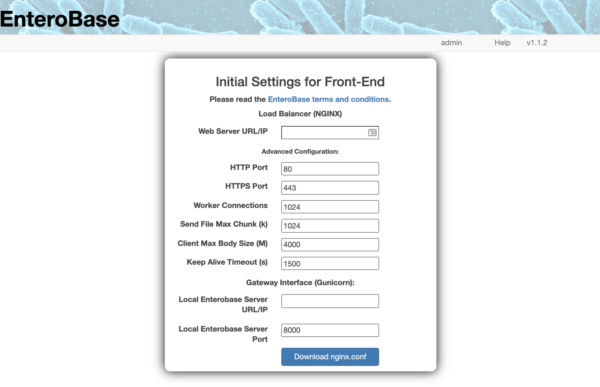

Local EnteroBase Integrations for Central EnteroBase
----------------------------------------------------

This page highlights the changes required in Central EnteroBase in order to enable Local EnteroBase to be installed and run correctly.

NGINX Configuration Page
========================

The NGINX configuration page is designed to enable the installer to obtain an "nginx.conf" file without having to write one from scratch. The user must simply input some basic details and the web-page returns the "nginx.conf" file. To read more about how the page looks from the point of view of the user, please take a look at the following page in the installation documentation: :ref:`nginx-prerequisites-label>`.

   **Fig. 1 - NGINX Configuration Form**

The above figure shows a screenshot of what the user sees when they go to the page. Below is a list of the validations enforced by the FlaskForm used to handle the input:

* Web Server URL/IP: 
* HTTP Port: Port number for HTTP access to your Local EnteroBase instance. The default value is 80.
* HTTPS Port: Port number for HTTPS access to your Local EnteroBase instance. The default value is 443.
* Worker Connections: The maximum number of parallel connections that the Local EnteroBase instance can handle. The default value is 1024.
* Send File Max Chunk (k): The maximum amount of data that can be sent with a single send_file() call in kilobytes. The default value is 1024.
* Client Max Body Size (M): The maximum upload file size that the Local EnteroBase instance can handle in megabytes. The default value is 4000.
* Keep Alive Timeout (s): How long the TCP connection between the client and the server stays open after an HTTP transaction has been completed in seconds. The default value is 1500.
* **Local EnteroBase Server URL/IP**: The URL or IP address of the server facilitating the assembly of short-read files. This value will be the same as the "Web Server URL/IP" value if you have installed them on the same server.
* Local EnteroBase Server Port: The port of the server facilitating the assembly of short-read files. The default value is 8000.
